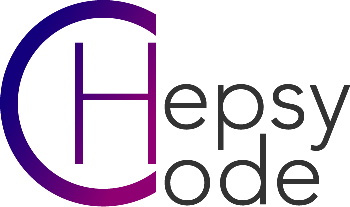

# Modeling System Environment (MSE)

This work validated the proposed approach on an MSE based on Eclipse and Sirius plugins: the HEPSYCODE project. To collect the traces we use Modeling Events Recorder (MER), an Eclipse plugin that interacts with Sirius-based graphical editors for EMF-based models and records users’ modeling event logs.

## HEPSYCODE
HEPSYCODE Modeling Methodology, Framework and tools for ASE submission

### Installation instructions

#### OVERVIEW
HEPSYCODE (HW/SW CO-DEsign of HEterogeneous Parallel dedicated SYstems) is a prototypal tool to improve the design time of embedded applications. It is based on a System-Level methodology for HW/SW Co-Design of Heterogeneous Parallel Dedicated Systems. The whole framework drives the designer from an Electronic System-Level (ESL) behavioral model, with related NF requirements, including real-time and mixed-criticality ones, to the final HW/SW implementation, considering specific HW technologies, scheduling policies and Inter-Process Communication (IPC) mechanisms. The system behavior modeling language introduced in HEPSYCODE, named HML (HEPSY Modeling Language), is based on the Communicating Sequential Processes (CSP) Model of Computation (MoC). It allows modeling the behavior of the system as a network of processes communicating through unidirectional synchronous channels. By means of HML, it is possible to specify the System Behavior Model (SBM), an executable model of the system behavior, a set of Non-Functional Constraints (NFC) and a set of Reference Inputs (RI) to be used for simulation-based activities. Through the execution of different steps, including a system-level Design Space Exploration (DSE) approach that allows the related co-design methodology to suggest an HW/SW partitioning of the application specification and a mapping of the partitioned entities onto an automatically defined heterogeneous multi-processor architecture, it is possible to proceed with system implementation.

HEPSYCODE uses Eclipse MDE technologies, SystemC custom simulator implementation, and an evolutionary genetic algorithm for partitioning activities, all integrated into an automatic framework that drives the designer from the first input to the final solution.

This repository contains the HEPSYCODE framework, which consists of a set of

- Reference libraries
- Scripts and makefiles
- Eclipse plugins 
- XML data exchange files
- SystemC files (part of the HEPSYM simulator)
- HW/SW Partitioning And Mapping (PAM) tool
 
#### INSTALLATION
 1. Download Eclipse Modelling Tool: [https://www.eclipse.org/downloads/eclipse-packages/](https://www.eclipse.org/downloads/packages/)
 2. Cloning this repository
 3. Import in Eclipse HEPSYCODE projects present in the folder and run a separate Eclipse application to run and debug the HEPSYCODE plug-in
 4. Install Systemc library (it is recommended version 2.3.3)
 5. Go to /home/.bashrc and insert the path of Systemc (folder lib-linux and include) the names of the variable must be SYSTEMCPATHLIB and SYSTEMCPATHINCLUDE for example:
    - export SYSTEMCPATHLIB=/usr/local/systemc-2.3.3/lib-linux64
    - export SYSTEMCPATHINCLUDE=/usr/local/systemc-2.3.3/include
    - Alternative: launch settings.sh script
 6. Try and enjoy the HEPSYCODE Tool!!!

#### SYSTEM REQUIREMENTS
 - Linux OS or Windows;
 - SystemC Libraries version 2.3.3;
 - Eclipse Modelling Tools with the following plugins in place: 
   - Eclipse Sirius
   - Eclipse Xtext

#### RELEASE NOTES
Latest Release: 2.0.0
 
#### LICENSE
GNU GENERAL PUBLIC LICENSE Version 3, 29 June 2007 (see https://www.gnu.org/licenses/gpl-3.0.en.html)
 
#### DEVELOPER RESOURCES
You can use the code from these repositories to experiment, test, build, and create patches, and issue pull requests (only by request).
 
#### SUPPORT
We currently support: **REMOVED FOR DOUBLE BLIND REVIEW**
 
### Getting Started Guidelines
To get started with HEPSYCODE, you can:

 1. Clone this repository to your local machine.
 2. Import the plugin projects in the MSE directory in Eclipse.
 3. Use the HEPSYCODE Sirius-based tool to create and edit your HEPSYCODE models.
 4. Generate code from your HEPSYCODE models using the HEPSYCODE M2M XText transformation code.
 5. Simulate your HEPSYCODE models using the HEPSYCODE HEPSIM2 simulator. Examples are available in the HEPSYCODE-Workbench folder.

## Modeling Events Recorder (MER)

MER (Modeling Event Recorder) is an Eclipse plugin that captures and serializes modeling events from Sirius graphical editor sessions in the XES standard log format. The plugin records user interactions, changes, and actions performed within the Sirius graphical editor, allowing you to analyze and gain insights into the modeling process.

### Features
- Capture modeling events in the Sirius graphical editor sessions.
- Serialize the recorded events in the XES standard log format.
- Export and save event logs to the metadata folder in the Elipse workspace.

### Installation and Usage

#### Prerequisites
- Eclipse Modeling Framework (EMF)

#### Steps
- Clone the repository to your local machine.
- Import the project into Eclipse as an existing Eclipse plugin project.
- Run the project as an Eclipse application.
- Create a HEPSYCODE modeling project.
- Open the Sirius graphical editor.
- Perform modeling actions and interactions in the Sirius graphical editor.
- Right-click on the modeling project in the project explorer and close the project.
- The recorded events will be serialized in the XES standard log format and can be saved for further analysis.

### How It Works
MER integrates seamlessly with the Eclipse IDE and hooks into the Sirius graphical editor's event system. It registers event listeners via EMF Notification API to capture various user interactions, changes, and actions performed during the modeling session. The plugin then converts these events into XES standard log format, ensuring compatibility with a wide range of process mining and analysis tools.

The XES log files generated by MER can be easily imported into popular process mining tools like ProM, Disco, or any other tool that supports the XES format.

### License
MER is released under the [Eclipse Public License 2.0](LICENSE), which allows you to use, modify, and distribute the software freely.

---

Thank you for using MER! We hope this plugin enhances your modeling experience and contributes to better insights into the modeling process. If you have any questions, issues, or suggestions, please feel free to open an issue on our GitHub repository. Happy modeling!

# Modeling System Environment (MSE) Video Tutorial

Watch the tutorial video for more info.

https://github.com/hepsycode/modelingOperationRec_ASE/assets/109613647/19a2ed81-4f15-42d8-b935-1e332a72899b
