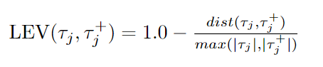

# Quality Checker Component

To evaluate synthetic data generated through LLMs, we developed python code to collect quantitative metric related to  diversity, correctness, and hallucination, as defined as follows. 

## Correctness Metric

The Correctness metric measures whether the data instance is related to the given label. Existing approaches for measuring correctness can be divided into two categories: automatic evaluation and human evaluation. Human evaluation has been conducted by prompt engineers to self-tune the \textit{Few-shot In-Context Learning} component. Automatic evaluation has been implemented to check the correctness of event syntax using the following metric:

This metric can be evaluated on the full $\tau^{+}_{j}$ synthetic trace while it is possible to cluster the metrics w.r.t syntax features (i.e., MER metamodel classes).

## Diversity Metric

Diversity measures the difference between a chunk of text and another in the generated instances. In this work, we evaluate the differences between synthetic traces generated by LLMs and real traces generated by designers using the MER component. The considered metrics are the follows: 

1. Edit-based similarities, also known as distance-based, measure the minimum number of single-character operations (e.g., insertions, deletions, or substitutions) required to transform one string into another. 
    - Levenshtein: Given two traces, the Levenshtein distance between them is the minimum number of single-character edits (insertions, deletions, or substitutions) required to change one trace into the other. Starting from the Levenshtein distance, the Levenshtein similarity is defined as follows:

    - Longest Common Substrings (LCS): Given real and synthetic traces, the maximum-length common events subsequence LCS(i,k), considering only characters insertion and deletion, where i and k represent the prefix length of trace string, is given by:

    - Jaro–Winkler: The Jaro Similarity is calculated using the following formula:

    - where m is the number of matching characters between real traces and synthetic traces and t is half the number of transpositions.
    
2. Token-based similarities focus on comparing strings based on their constituent tokens or words, rather than individual characters. 
    - Jaccard: measure the size of the intersection divided by the size of the union of the strings, as follows:

    - Sorensen-Dice: evaluate twice the number of elements common to both traces divided by the sum of the number of elements in each trace, as follows:

    - Q-Gram: count the number of occurrences of different q-grams in the two traces. The Q-gram similarity is described as follows:

    - Cosine: similarity between two non-zero vectors of an inner product space that measures the cosine of the angle between them, as follows:

These metrics can be used to evaluate how well LLMs can emulate both the designer's modeling approach and patterns, as well as human-based modeling approaches.

## Hallucination Metric

In the scope of the paper, we define the hallucination as the number of additional operations, namely non-realistic events, generated compared to the human ones by specifying the following metric:

This metric can be evaluated on the full synthetic trace file and real trace file and also for all the considered DSL metamodel classes. If these metrics are greater than 1, then the LLM produces an incorrect synthetic trace file (i.e., hallucination results, the LLM adds more classes than those present in the real trace model).

