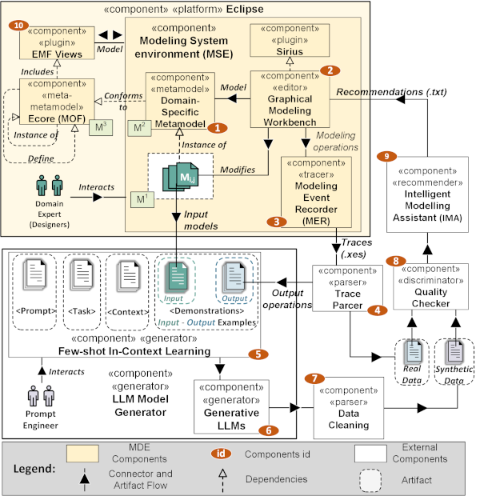

# Towards Synthetic Trace Generation of Modeling Operations using In-Context Learning Approach

This repository presents our proposed approach and the corresponding replication package. The core concept involves integrating a Modeling Event Recorder (MER) framework within a Modeling System Environment (MSE). This framework captures and traces designer activities and modeling steps. Subsequently, it injects these events into Intelligent Modeling Assistants (IMAs), enabling the generation of personalized suggestions for modeling actions most relevant to each designer. The integration path is shown in the Figure below.

<p align="center">

</p>

The repository is organized as follows:

1. **MSE** folder contains HEPSYCODE Graphical Modeling Workbench and the Modeling Event Recorder (MER);
2. **Trace Parser** folder contains the results of parsing the MER tracing files;
3. **LLM Synthetic Dataset** folder contains the prompt schemas used and the results of the queries made to the considered LLMs;
4. **Quality Checker** folder contains the Python code for extracting metrics of correctness, diversity, and hallucination, with corresponding Jamovi projects for statistical analyses in the results_RQ1 folder;
5. **IMA** folder contains MORGAN, the recommender system used in this work, with two folders containing the results related to RQ2 and RQ3.

### RELEASE NOTES
Latest Release: 1.0.0
 
### LICENSE
GNU GENERAL PUBLIC LICENSE Version 2, June 1991 (see https://www.gnu.org/licenses/gpl-3.0.en.html)
 
### DEVELOPER RESOURCES
Source Repositories: [[https://github.com/hepsycode/SLIDE-x](https://github.com/hepsycode/SLIDE-x](https://github.com/hepsycode/modelingOperationRec_ASE))

- Clone: 
    - ssh: [git@github.com:hepsycode/modelingOperationRec_ASE.git](git@github.com:hepsycode/modelingOperationRec_ASE.git)
    - https: [https://github.com/hepsycode/SLIDE-x.git](https://github.com/hepsycode/modelingOperationRec_ASE.git)
 
You can use the code from these repositories to experiment, test, build, and create patches, and issue pull requests (only by request).
For any bug or doubt, contact us or open an issue.
 
### SUPPORT
We currently support: 

 1. Email: 
    - Vittoriano Muttillo:
       - vittoriano.muttillo@guest.univaq.it,
       - vmuttillo@unite.it
       - vittoriano.muttillo@gmail.com
    - Claudio Di Sipio
       - claudio.disipio@univaq.it
    - Riccardo Rubei
       - riccardo.rubei@univaq.it
    - Luce Berardinelli
       - luca.berardinelli@jku.at
 2. Issues on GitHub

## Additional information
Research publications are available at https://hepsycode.github.io/

## How to Cite?
If you use our work in your research, please cite: 
```
@inproceedings{10.1145/3691620.3695058,
author = {Muttillo, Vittoriano and Di Sipio, Claudio and Rubei, Riccardo and Berardinelli, Luca and Dehghani, MohammadHadi},
title = {Towards Synthetic Trace Generation of Modeling Operations using In-Context Learning Approach},
year = {2024},
isbn = {9798400712487},
publisher = {Association for Computing Machinery},
address = {New York, NY, USA},
url = {https://doi.org/10.1145/3691620.3695058},
doi = {10.1145/3691620.3695058},
booktitle = {Proceedings of the 39th IEEE/ACM International Conference on Automated Software Engineering},
pages = {619–630},
numpages = {12},
location = {Sacramento, CA, USA},
series = {ASE '24}
}
```

